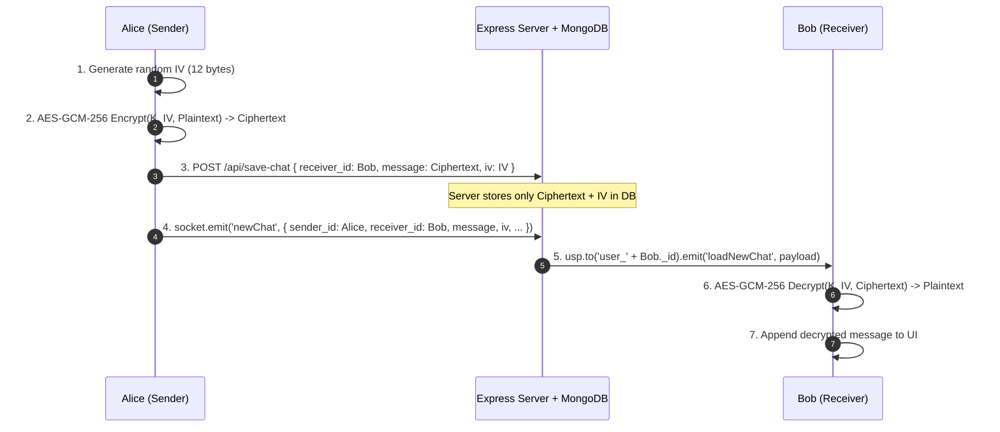

# 📐 Architecture & Security Documentation

This document provides a deep dive into the system architecture, End-to-End Encryption (E2EE) cryptographic protocols, client key management, and mobile-responsive layout mechanics for ChatApp.

---

## 1. System Overview

```text
+-----------------------------------------------------------------------------------+
|                                 Next.js Frontend                                  |
|                                                                                   |
|  +-----------------------------+               +-------------------------------+  |
|  |     App Router Pages        |               |      E2EE WebCrypto Core      |  |
|  |  - / (Dashboard)            | <-----------> |  - ECDH (P-256) Key Exchange  |  |
|  |  - /login                   |               |  - AES-GCM (256-bit) Cipher   |  |
|  |  - /register                |               |  - Browser IndexedDB Storage  |  |
|  +--------------+--------------+               +---------------+---------------+  |
+-----------------|----------------------------------------------|------------------+
                  | HTTP/REST (/api/*)                           |
                  | (Proxy via Next rewrites)                    | WebSocket (/socket.io/*)
                  v                                              v
+-----------------------------------------------------------------------------------+
|                                 Express Backend                                   |
|                                                                                   |
|  +-----------------------------+               +-------------------------------+  |
|  |       RESTful APIs          |               |      Socket.io Gateway        |  |
|  |  - User Auth & Sessions     |               |  - Namespace: /users-namespace|  |
|  |  - Public Key Store (JWK)   |               |  - Private Rooms: user_<id>   |  |
|  |  - Encrypted Chat Storage   |               |  - Targeted Message Routing   |  |
|  +--------------+--------------+               +---------------+---------------+  |
+-----------------|----------------------------------------------|------------------+
                  |                                              |
                  +-----------------------+----------------------+
                                          |
                                          v
                                 +------------------+
                                 |  MongoDB Storage |
                                 |  (Users & Chats) |
                                 +------------------+
```

---

## 2. End-to-End Encryption (E2EE) Protocol

### 2.1 Cryptographic Primitives
- **Key Agreement**: **ECDH (Elliptic Curve Diffie-Hellman)** on the NIST **P-256** curve (`prime256v1`).
- **Message Cipher**: **AES-GCM (Advanced Encryption Standard in Galois/Counter Mode)** with **256-bit** key length.
  - AES-GCM provides both **confidentiality** and **integrity authentication**. Any tampering with the ciphertext or IV will cause decryption to fail.
- **Initialization Vector (IV)**: A cryptographically random **12-byte (96-bit)** buffer generated via `window.crypto.getRandomValues(new Uint8Array(12))` for every single message. IVs are never reused.

### 2.2 Key Lifecycle & IndexedDB Storage
1. **Key Generation**:
   - When a user logs in, `E2EEService.init(userId)` queries the local IndexedDB database `ChatApp_E2EE_Keys` in the `keypairs` store.
   - If no key pair exists for this `userId`, the client invokes:
     ```typescript
     window.crypto.subtle.generateKey(
       { name: 'ECDH', namedCurve: 'P-256' },
       true,
       ['deriveKey', 'deriveBits']
     );
     ```
   - The generated private key is stored directly in IndexedDB.
   - The public key is exported as JWK format and synchronized to the backend via `POST /api/save-public-key`.

2. **Why IndexedDB?**:
   - IndexedDB can store native `CryptoKey` objects via the structured clone algorithm.
   - Unlike `localStorage`, which only stores strings and is susceptible to XSS extraction if keys are serialized, storing keys in IndexedDB limits exposure and prevents transmission to the server.

### 2.3 Shared Secret Agreement
- Alice has keypair $(d_A, Q_A)$ where $d_A$ is private and $Q_A$ is public.
- Bob has keypair $(d_B, Q_B)$ where $d_B$ is private and $Q_B$ is public.
- Alice derives the symmetric AES key:
  $$K = \text{ECDH}(d_A, Q_B)$$
- Bob derives the exact same symmetric key:
  $$K = \text{ECDH}(d_B, Q_A)$$
- **Zero Knowledge**: The server only holds $Q_A$ and $Q_B$. Without $d_A$ or $d_B$, the server cannot derive $K$.

### 2.4 Message Encryption & Decryption Flow



---

## 3. Mobile Responsive Architecture

The Next.js dashboard ([frontend/app/page.tsx](file:///d:/Codes/Chating-Web-APP/frontend/app/page.tsx)) utilizes an adaptive layout strategy:

### 3.1 Breakpoint Strategy
- **Mobile Viewport (`< 768px`)**:
  - Controlled by the `activeContact` React state:
    - If `activeContact === null`: `ContactList` takes `w-full` (`block`), while `ChatArea` is `hidden`.
    - If `activeContact !== null`: `ContactList` is `hidden`, while `ChatArea` takes `w-full` (`block`).
  - The top header in `ChatArea` renders an `<ArrowLeft />` back button (styled `md:hidden`), clicking which resets `activeContact = null`, immediately returning the user to the contact list.
- **Tablet & Desktop Viewport (`>= 768px`)**:
  - `ContactList` is permanently visible as a left sidebar (`w-80 lg:w-96 md:block`).
  - `ChatArea` is permanently visible on the right (`flex-1 md:block`).
  - If no contact is active, `ChatArea` displays a security placeholder state.

### 3.2 Mobile Keyboard & Viewport Resizing
- The layout uses `h-[100dvh]` (dynamic viewport height) rather than standard `100vh` to avoid clipping issues caused by mobile browser address bars and on-screen virtual keyboards.
- The input footer remains sticky at the bottom (`shrink-0`) while only the message history container scrolls (`overflow-y-auto`).

---

## 4. Database Models

### 4.1 User Schema (`models/user.js`)
```javascript
{
  name: { type: String, required: true },
  email: { type: String, required: true, unique: true },
  password: { type: String, required: true },      // Bcrypt hash (cost: 10)
  mobile: { type: Number, required: true },
  image: { type: String, default: 'images/default-avatar.svg' },
  is_online: { type: String, default: '0' },        // '1' for online, '0' for offline
  publicKey: { type: Object, default: null },       // JWK ECDH P-256 public key
  timestamps: true
}
```

### 4.2 Chat Schema (`models/chat.js`)
```javascript
{
  sender_id: { type: ObjectId, ref: 'User', required: true },
  receiver_id: { type: ObjectId, ref: 'User', required: true },
  message: { type: String, required: true },        // AES-GCM Ciphertext (Base64)
  iv: { type: String, required: true },             // AES-GCM IV (Base64, 12 bytes)
  timestamps: true
}
```
